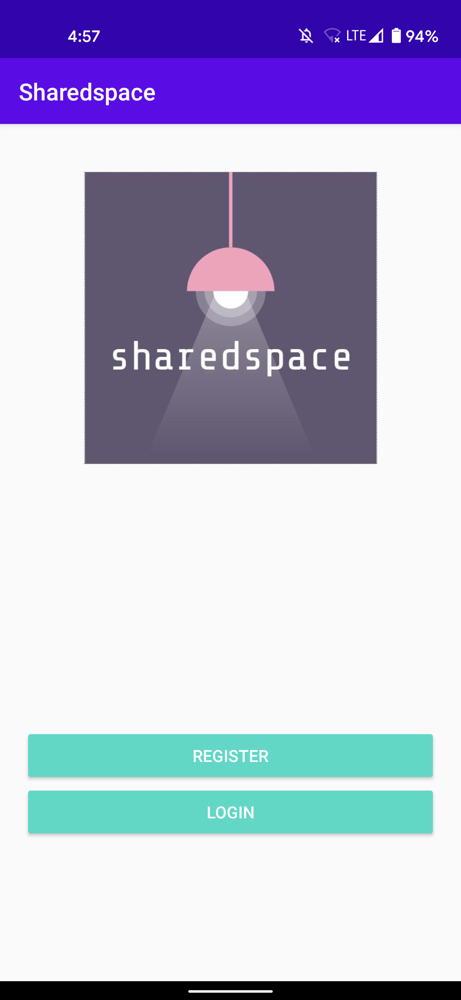
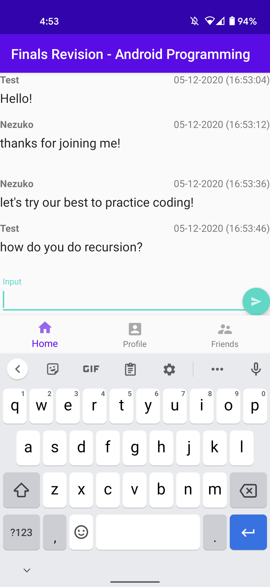

# Sharedspace

With the rise of online learning, our education and communication has changed drastically. Our app aims to improve the online learning environment through a shared and supportive communication platform with peers.

The app allows users to create and join small group chat rooms, based on which subjects the user has selected. Other users would then be able to see and join that room, allowing discussion that particular topic.

Additional features include Google Calendar integration, helpful links to SUTD pages on the home page, a Profile page with a handy notepad to store notes/tasks, and a Friends page to view all users.

## UI
   

   

## Features
- Account registration and authentication
- Instant messaging platform
- Firebase storage
- Local calendar sync
- Notepad

## Open Source implementations
- [Circle Image View](https://github.com/hdodenhof/CircleImageView)
- [Agenda Calendar View](https://github.com/Tibolte/AgendaCalendarView)
- [Photo Upload](https://github.com/square/picasso)

