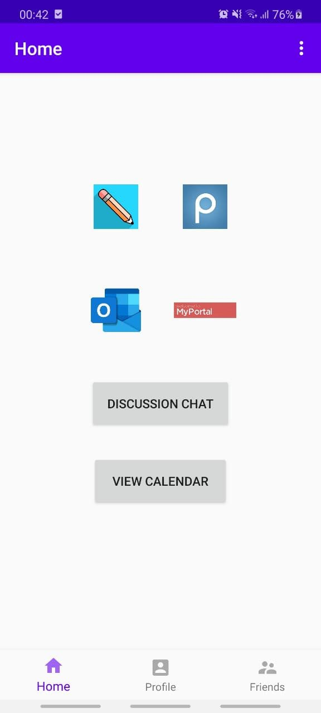
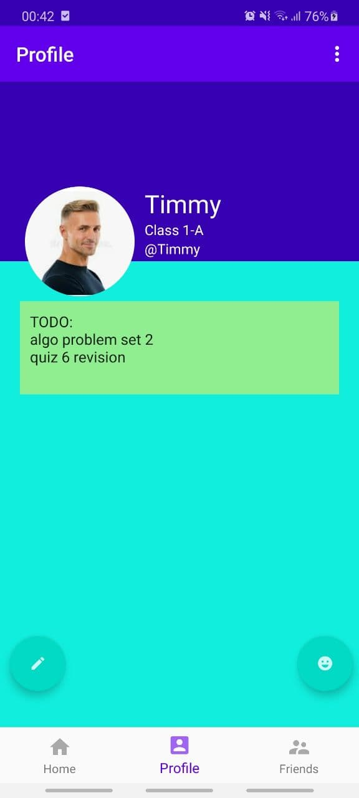
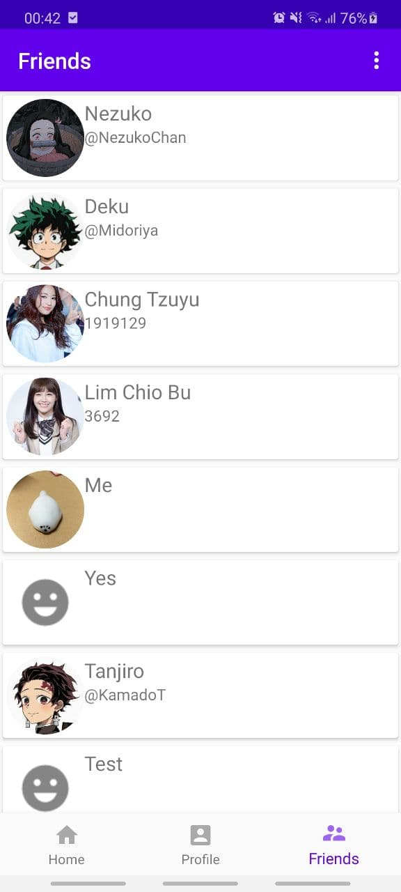
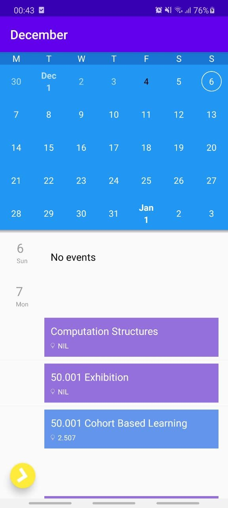
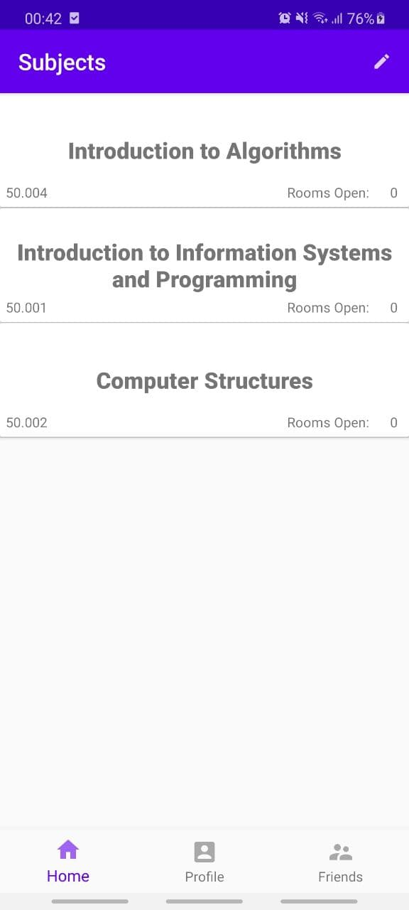
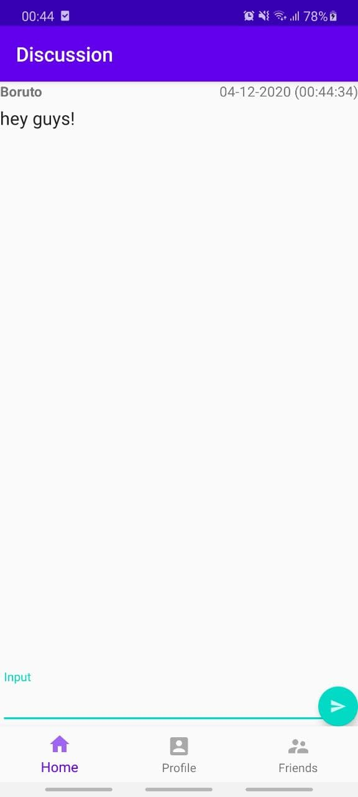

# Sharedspace

With the rise of online learning, our education and communication has changed drastically. Our app aims to improve the online learning environment through a shared and supportive communication platform with peers.

## UI
  

  

## Features
- Account registration and authentication
- Instant messaging platform
- Firebase storage
- Local calendar sync
- Notepad

## Open Source implementations
- [Circle Image View](https://github.com/hdodenhof/CircleImageView)
- [Agenda Calendar View](https://github.com/Tibolte/AgendaCalendarView)
- [Photo Upload](https://github.com/square/picasso)

